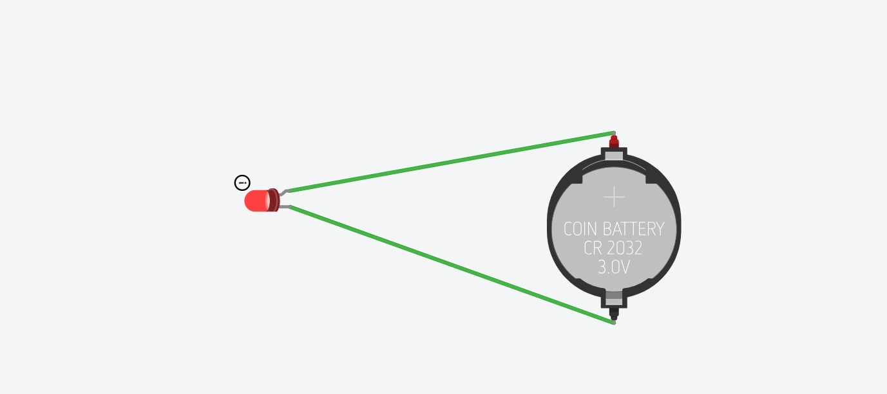
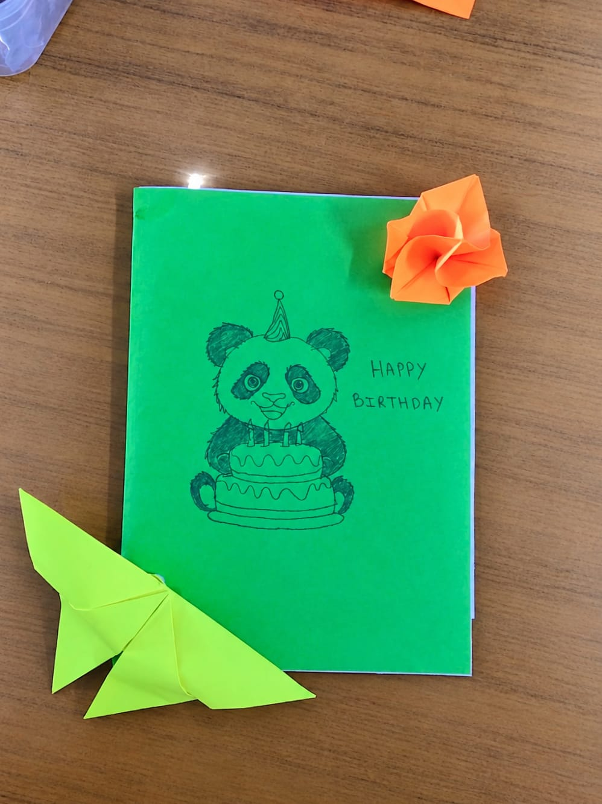

### **GREETING CARD**

### **1\. Abstract**

### This project presents a handmade birthday greeting card using colored paper, origami flowers, and a panda-themed design. An LED light is incorporated to create an interactive effect, glowing when the card is opened and turning off when it is closed. This project combines creativity, basic electronic circuits, and craft skills to create an attractive and innovative greeting card.

### **2\. Description**

The handmade birthday greeting card is designed using colored paper and basic craft materials. It includes a panda drawing, decorative origami flowers, and an LED lighting system. The LED automatically turns on when the card is opened and turns off when it is closed. This project demonstrates creativity, innovation, and the practical application of basic electronics.

### **3\. Materials Required**

* Colored paper  
* White paper  
* Sketch pens  
* Scissors  
* Glue  
* Origami paper  
* LED light  
* Battery  
* Connecting wires  
* Magnetic switch

### **4\. Procedure**

First, a sheet of paper is folded in half to create the greeting card. A panda-themed birthday design is drawn on the front, and “Happy Birthday” is written on the card. Decorative flowers are made using origami paper and attached to the card using glue. The LED, battery, and magnetic switch are then connected to create the lighting circuit. The switch is arranged so that the LED glows when the card is opened and turns off when it is closed. Finally, the circuit and decorations are tested to ensure that the card works properly.

### **5\. Working Principle**

The LED circuit operates using a battery as the power source. A magnetic switch controls the flow of current to the LED. When the card is opened, the switch activates the LED, and when the card is closed, the circuit is disconnected, turning off the LED.

### **6\. Notes**

* Keep the folds neat and clean.  
* Use scissors carefully.  
* Connect the LED with the correct polarity.  
* Ensure that the wires are properly connected.  
* Insulate the connections to prevent short circuits.  
* Make sure the card opens and closes easily.  
* Handle the electronic components carefully.

### **7\. Conclusion**

The handmade greeting card successfully combines art, craft, and basic electronics. The automatic LED lighting feature makes the card more attractive and interactive. This project helps develop creativity, practical skills, and an understanding of simple electronic circuits.

**HAND MADE GREETING CARD**

